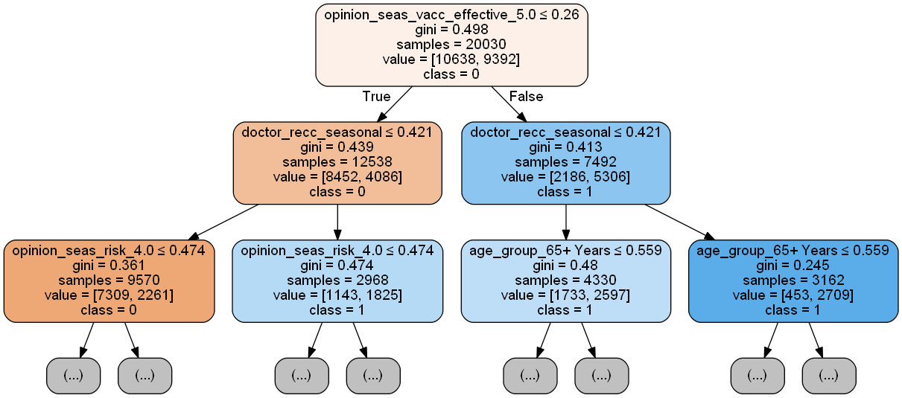

# Understanding Seasonal Flu Vaccine Likelihood in the United States


## Business Problem

In 2010, the seasonal flu virus was responsible for an estimated 290,000 hospitalizations and 37,000 deaths. The CDC recommends the seasonal flu vaccine as it has been shown to reduce the number of deaths, intensive care unit (ICU) admissions, ICU length of stay, and overall duration of hospitalization among hospitalized flu patients.

In light of their new vaccination initiative, the CDC has conducted surveys on random individuals throughout the country. **The Goal:** Deliver an inferential binary classifier model to stakeholder (CDC) that determines if someone will take the Seasonal Flu vaccine based on responses to a phone survey. Predictions on future surveys can help assess public health risk by determining the percent of the population likely to get vaccinated.

## Data Understanding
The dataset was from the U.S. Department of Health and Human Services (DHHS) and consisted of phone surveys conducted in 2009. The survey contained demographic questions (age,sex,education etc.) along with opinion questions (vaccine effectiveness, flu risk, etc.) The target variable was whether or not the vaccine was taken. 47% of respondents to the survey had taken the 2009 seasonal flu vaccine.

## Data Cleaning
The dataset also included questions related to the 2009 H1N1 flu and vaccine. These input variables have been dropped from the dataset due to relevance to the business problem (seasonal flu vaccine). In addition, four input variables had high amounts of missing data (>10% missing):

|  Dropped Column        | % Nan |
|------------------------|-------|
| health_insurance       |  46%  |
| income_poverty         |  17%  |
| employment_industry    |  50%  |
| employment_occupation  |  50%  |

These columns were dropped from the dataset. Finally, the remaining columns were preprocessed by the following steps after a train/test split:

1. Missing Values Imputed Using Median
2. One Hot Encoded Categorical Variables
3. Scaled Input Variables

## Feature Selection and Parameter Tuning
Recursive Feature Elimination was used for selecting the best features for each model. Gridsearch was used to identify optimal values for model parameters.

## Results
The performance metric used for optimization was ROC curve AUC for the following reasons:

* the fpr and fnr have equal importance for business problem
* the observations are balanced for each class
* binary classification problem

### Logistic Regression
The initial model chosen was logistic regression. This was due to the target variable being binary and the goal being an inferential model. The initial logistic regression model used one input feature selected by RFE which produced an ROC AUC score of .680 for both cross validation and test data showing no overfitting. Before adding more features, a chi squared test between each input variable was run which showed significant collinearity between the top performing features. Therefore, a decision tree was chosen as the next model for adding more features to improve the ROC AUC score.

### Decision Tree
The team decided to use a decision tree as a step-up model as it is immune to multicolinearity, easy to visualize and easy to interpret. The initial decision tree model consisted of 5 input variables chosen by RFE. The model showed the most important features for someone to get the seasonal flu vaccine:

1. Scoring a 5/5 for vaccine efficacy opinion
2. Being 65+ or older
3. Doctor recommending the vaccine

<table class="image">
<caption align="top" style="text-align: center;"><font size="+1">First Two Splits of Decision Tree Model</font></caption>
<tr><td></td></tr>
</table>

The average cross validation ROC AUC is 0.81 (81%) which is considerably higher than the average cross validation ROC AUC of the one feature logistic regression model (68%). The test ROC AUC is 81.4%. Although the model is slightly overfitting, this model has a higher test ROC AUC than the one feature logistic regression model (68%).

### Random Forest - Final Model
To further improve on the ROC curve AUC, Random Forest was selected as the final model to help reduce overfitting from just a single decision tree. The average cross validation ROC AUC is 0.838 (83.8%), which is higher than the average cross validation ROC AUC of the Decision Tree (80.9%). The test ROC AUC is 84.4%. This model has a higher test ROC AUC than the decision tree model (81.4%).

In addition, the random forest model shows improvement over previous models for accuracy and f1 scores:


There is a slight decrease in precision score moving from decision tree to random forest but the increase in recall score is much higher.

## Conclusion

The below graph shows the improvement on the performance metric of ROC AUC of each model. The final model (Random Forest) showed an increase of .17 over the logistic regression model and .34 over the baseline model (majority class).


From the initial tree splits of the model the following recommendations can be made to improve the phone survey and increase the likelihood of someone taking the vaccine.

Recommendations:

1. Shorten survey to important opinion features to improve survey response
    * Doctor Recommended Vaccine?
    * Age Group
    * Opinion on Vaccine Efficacy
2. Education on vaccination efficacy will help improve peoples willingness to receive a seasonal flu vaccine
3. Encourage healthcare professionals to recommend the seasonal flu vaccine 

## Future Research

* Look to improve completion rate of survey so the dropped columns listed in data cleaning section can be utilized.
* Gather more demographic data like location to make more inferential recommendations

## More Information

To learn more about the dataset used visit [U.S. Department of Health and Human Services (DHHS). National Center for Health Statistics.](https://www.cdc.gov/nchs/nis/data_files_09_prior.htm). For more information on vaccinations and the seasonal flu visit the [CDC Website](https://www.cdc.gov/flu/index.htm)


## Citations

[1] https://www.cdc.gov/flu/prevent/flushot.htm

[2] https://www.drivendata.org/competitions/66/flu-shot-learning/page/210/

## Repository Structure

```
├── code
│   ├── __pycache__/
│   ├── __init__.py
│   ├── preprocessing.py
│   └── visualization.py
├── appendix
│   ├── chi_square_test.ipynb
│   ├── log_reg_notebook.ipynb
│   ├── decision_tree_notebook.ipynb
│   ├── preprocessing.xlsx (Preprocessing Outline)
│   └── preprocessing_notebook.ipynb
├── images
├── README.md
├── seasonal_vaccine_model_pres.pdf
├── seasonal_vaccine_model.pdf
└── seasonal_vaccine_model_fb.ipynb
```